<!-- PROJECT LOGO -->
<br />
<div align="center">
  <a href="https://github.com/othneildrew/Best-README-Template">
    
  </a>

  <h3 align="center">Best-README-Template</h3>

  <p align="center">
    An awesome README template to jumpstart your projects!
    <br />
    <a href="https://github.com/othneildrew/Best-README-Template"><strong>Explore the docs »</strong></a>
  </p>
</div>

<br/><br/><br/>


<!-- TABLE OF CONTENTS -->

  <summary>Table of Contents</summary>
  <ol>
    <li>
      <a href="#task-instructions">Task Instructions</a>
    </li>
    <li>
      <a href="#high-level-plan">High Level Plan</a>
    </li>
    <li>
      <a href="#steps">Steps</a>
    </li>
    <li>
      <a href="#afterthoughts">Afterthoughts</a>
    </li>
  </ol><br/><br/>


<!-- Task Instructions -->
# Task Instructions 
Create an Azure app service that alerts when CPU is higher than 50% for over 5 minutes.<br/>
Please deploy a file index.html that says “Hello World1” and connect a repo of your choice.<br/>
Then, update the repo with “Hello World2” and deploy it again.<br/>
The deployment should swap between slots of the app service.
<br/><br/><br/>

<!-- High Level Plan -->
# High Level Plan
I will break the task into two parts:
* Part1: Setting up the infrastructure & deployment configuration
* Part2: Setting up the CPU alert


Here is a high level description of what I will be doing to reach our goals:

<br/>

Part1:

### Azure
* Create a Resource Group 
* Create a Service Plan within our resource group 
* Create an App Service (Webapp) within our resource group 
* Create a secondary (staging) slot to implement swapping
* Connect our staging app to source control
* Enable “auto-swap” on the secondary slot
* Configure deploy .yml to deploy to staging


### GitHub
* Fork a “Hello world” ASP.NET demo webapp project 
* Alter the index.cshtml to display "Hello World 1"
* Alter the deploy .yml file to target staging slot 
* Change the "publish profile" secret to support our staging environment
* Alter the index.cshtml to display "Hello World 2" 
<br/><br/><br/>

Part2:

### Azure
* Create Action Group
* Create Alert


## Disclaimer 
I am aware that the task requires me to setup alerts for CPU percentage, however to do so I would need to upgrade my App Service Plan, which I currently can't since I am currently experiencing throttling issues from Azure (more on that below)<br>
I will be setting up an alert for CPU Time and will assume setting up alerts for CPU percentage is about the same effort.<br/> 
[Microsoft Documentation - CPU Time vs. CPU Percentage](https://learn.microsoft.com/en-us/azure/app-service/web-sites-monitor#cpu-time-vs-cpu-percentage)
<br/><br/>


<!-- Steps -->
# Steps
Here is a step by step breakdown explaining what I did to set up our Azure App. 
<br/><br/><br/>


<!-- Step 1 - Create a Git Repo -->
# Step 1 - Create a Git Repo
Create a new repo by forking a .NET 6 Hello World App Service Web App Project.<br/><br/>
* Original repo can be found [here](https://github.com/Azure-Samples/dotnetcore-docs-hello-world).<br/>
* My Forked repo can be found [here](https://github.com/hammodisorg/EasyTraveling).

 <br/><br/>


<!-- Step 2 - Create Resource Group -->
# Step 2 - Create Resource Group
We can use azcli to create a resource group to contain all of the Azure resources for this service.
  ```sh
  az group create -l westeurope -n app_service_rg_v1
  ```


 <br/><br/>


 # Step 3 - Create App Service
Using azure portal, navigate to resource group → create → App Service Plan <br/><br/>
 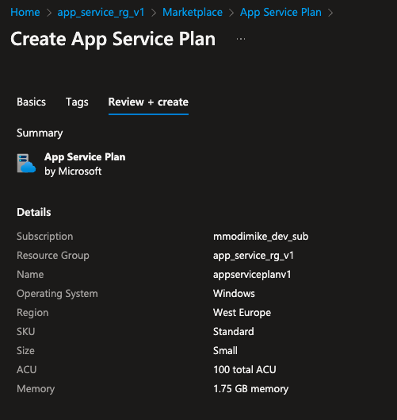 <br/>
 
*  Upon creating documentation for the assignment submission I kept running into issues creating a new service plan: message:<br/> 
_"App Service Plan Create operation is throttled for subscription cdcb5303-2664-4b37-a610-8b0840d8206d. Please contact support if issue persists."_
<br/>
* I was developing the solution using terraform, which probably triggered throttling. Thus, for the rest of the steps I will use the original service plan I created for development.


<br/><br/>


# Step 4 - Create Web App
Under App Services click create Web App.<br/>
Make sure to Enable Continuous deployment under Github Actions Settings. This option will auto-generate a git Actions workflow .yml file which we will be using.<br/><br/>
 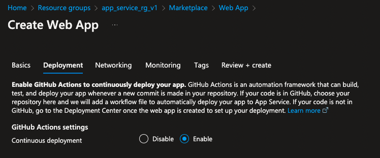 <br/><br/>
  <br/>


<br/><br/>

# Step 5 - Add a second deployment slot
Go to the resource group → App Service.<br/>
Under Deployment Slots → Add Slot → ( we will call it staging )<br/><br/>
 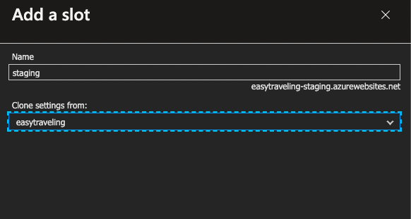 


<br/><br/>


# Step 6 - Deploy "Hello World 1"
Currently, we have two slots:
* Production: https://easytraveling.azurewebsites.net/<br/>
  _Our app is currently deployed here, currently it displays this_<br/><br/>
  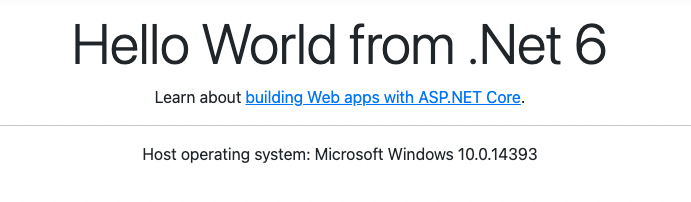 <br/><br/>


* Staging: https://easytraveling-staging.azurewebsites.net/<br/>
  _Nothing is Deployed here yet._<br/><br/>


Lets go to our codebase and alter index.cshtml to display "Hello World 1"<br/>
We navigate to our repo and alter the index.cshtml file:<br/>
_https://github.com/hammodisorg/EasyTraveling/blob/master/Pages/Index.cshtml_<br/><br/>
 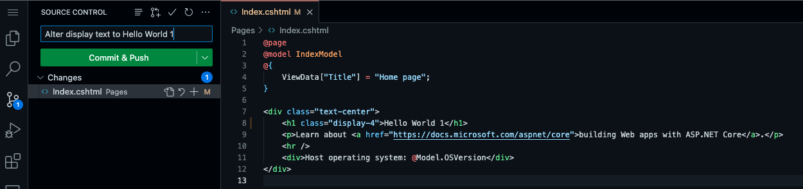 <br/><br/>

The commit will trigger our gitflow workflow & re-deploy our updated code directly to our Production slot.<br/>
After the above commit, this is the status of our environments:<br/>
* Production: https://easytraveling.azurewebsites.net/<br/>
  _Our app is currently deployed here, but now with the correct text_<br/><br/>
  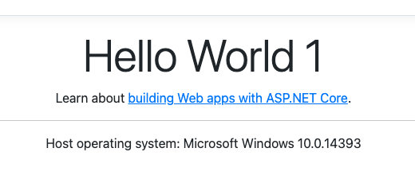 <br/><br/>


* Staging: https://easytraveling-staging.azurewebsites.net/<br/>
  _Nothing is Deployed here yet._<br/><br/>


<br/><br/>


# Step 7 - Configure the “staging” deployment slot for auto swap
* Go to the resource group → staging (easytraveling/staging) (App Service Slot)<br/>
* On the left bar Setting menu → Configuration → General settings<br/>
* Scroll Down to Deployment Slot:<br/>
* Auto Swap Enabled → true<br/>
* Auto Swap deployment (target) → production<br/>


<br/><br/>


# Step 8 - Alter gitflow workflow .yml to target staging slot instead of Production
Our .yml file can be found here:<br/>
We want to change slot name to staging.<br/>
https://github.com/hammodisorg/EasyTraveling/blob/master/.github/workflows/master_easytraveling.yml<br/><br/>
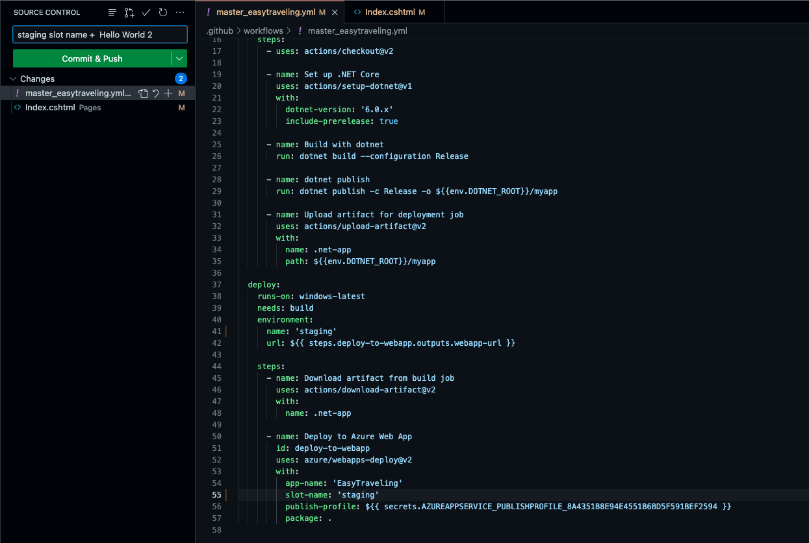 <br/><br/>


<br/><br/>


# Step 9 - Update the publish-profile Secret for Git Actions
We Will Also have to update the Git Actions secret to reflect the staging slot publish-profile, instead of the existing production publish-profile.<br/>
This is done by navigating to staging slot on Azure and clicking “Download publish profile” from the top bar.<br/><br/>
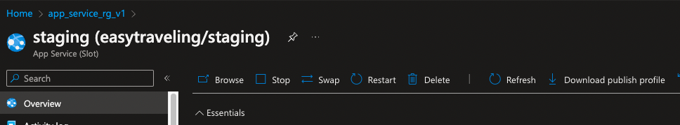 <br/><br/>

We then update the secret value in our Github Repo by navigating to Settings --> Security --> Secrects & Variables --> Actions<br/><br/>
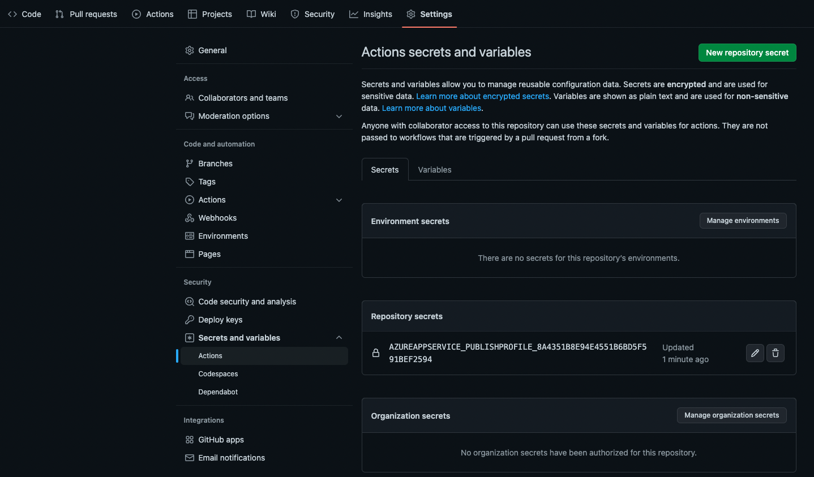 <br/><br/>


<br/><br/>


# Step 10 - Update Repo index with "Hello World 2"
Finally, we will change index.cshtml to "Hello World 2".<br/>
_( I grouped this commit with the above gitflow change as to trigger a single deployment)_<br/><br/>

The commit will trigger a deployment, target slot is staging. <br/>
Once the deployment is complete, App Service should swap Production ("Hello World 1") with staging ("Hello World 2").<br/><br/>

This is the status after deployment<br/>

* Production: https://easytraveling.azurewebsites.net/<br/><br/>
  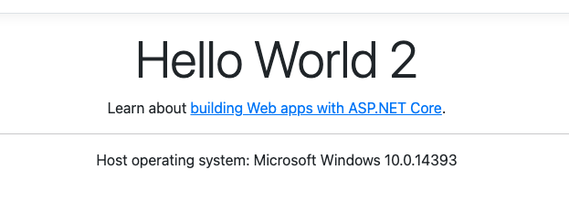 <br/><br/>


* Staging: https://easytraveling-staging.azurewebsites.net/<br/><br/>
   <br/><br/>


<br/><br/>


# Step 11 - Verify the "deploy to staging --> swap to Prudction" flow works again
I will disconnect the production slot from a Source code and commit a "Hello World 3" to our repo.<br/> 
Disconnecting the repo does not appear to be necessary as the workflow determines target enviroment, but for the time being this sounds safer to me as to avoid unwanted mistakes.<br/>
Expected result is to have it deployed to staging, swapped into production, & having Production reflect "Hello World 3", & Staging "Hello World 2".<br/><br/>
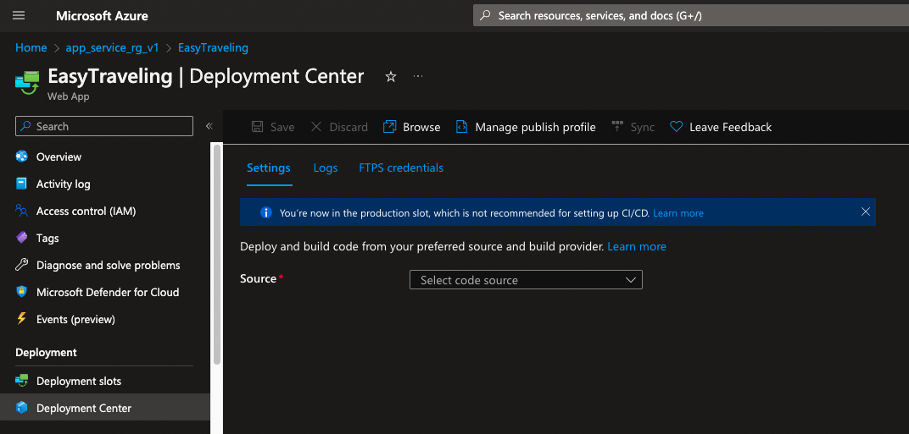 <br/><br/>

This is the status after deployment<br/>

* Production: https://easytraveling.azurewebsites.net/<br/><br/>
   <br/><br/>


* Staging: https://easytraveling-staging.azurewebsites.net/<br/><br/>
  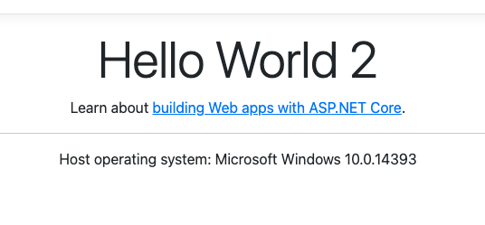 <br/><br/>


<br/><br/>


# Step 12 - Setting up alerts: Create Action Group
We navigate to our app in the Azure portal & navigate to "Monitoring" --> "Alerts" on the left hand side.
Create --> Action group<br/><br/>
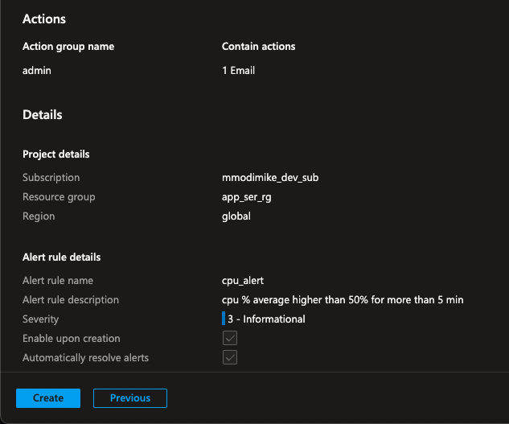 <br/>


# Step 13 - Setting up alerts: Create Alert
We navigate to our app in the Azure portal & navigate to "Monitoring" --> "Alerts" on the left hand side.
Create --> Alert Rule<br/>
I have chosen an arbitrary value of "50 CPU Time" instead of our originally desired 50%. ( See Disclaimer under Part 2 of <a href="#high-level-plan">High Level Plan</a> )

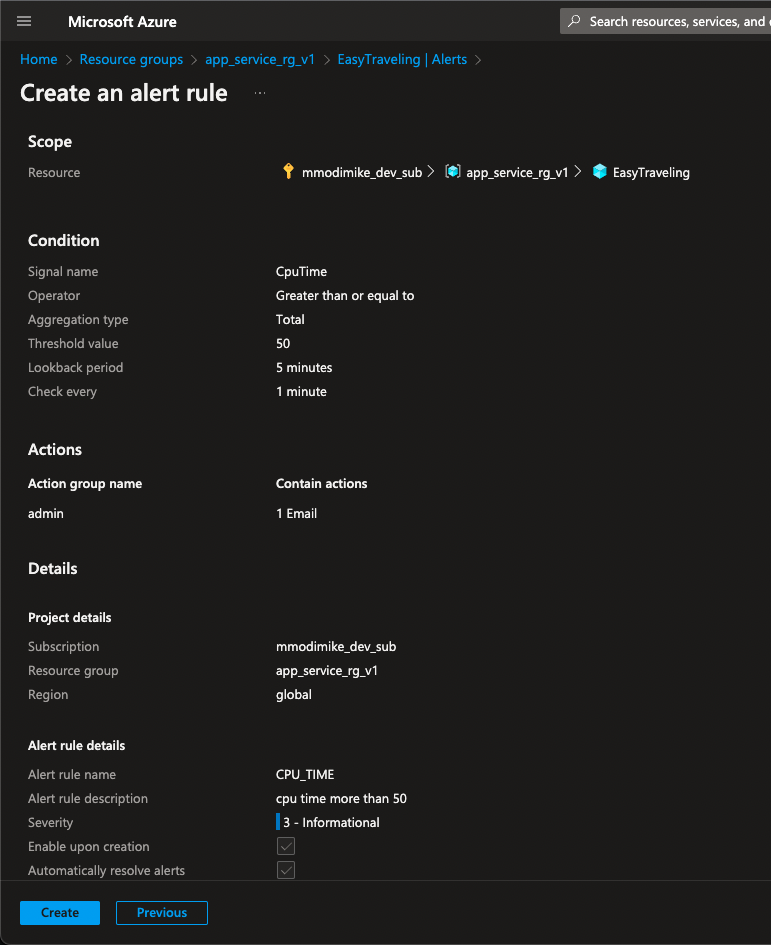<br/><br/><br/>


<!-- Afterthoughts -->
# Afterthoughts
I approached the task with zero knowledge in App Services & Slots. I also had no prior experience with Git Actions.<br/>
I initially invested about 2 hours understanding the concepts then jumped into Azure and started to play around.<br/>
About 5-6 hours in I had a working example configured manually, so I decided to take a step back & start implementing my manual actions as IAS, as I felt it would elevate my solution.<br/>
I'm comfortable with Terraform & had executable terraform code that creates all the needed resources within a couple of hours.<br/><br/>


However, that's when I started running into problems. Terraform apply was taking too long and slowing down my development cycles, particularly provisioning azurerm_service_plan,<br/>
so I decided to reference the one I had already created manually and continue working. Another issue was, upon swapping, Terraform state was being altered. I found some workarounds which involved re-importing state after applying, however it was totally out of scope of this project and sounded like a bandaid.<br/>
I would need to invest some more time to understand if in fact Terraform is a suitable tool for such an app.<br/><br/>


Picked up the next day & tried to provision azurerm_service_plan so I can finalize my project, but I was getting throttled by Azure:<br/>
"App Service Plan Create operation is throttled for subscription cdcb5303-2664-4b37-a610-8b0840d8206d. Please contact support if issue persists."<br/>
Some [Quick Googling](https://stackoverflow.com/questions/70581454/app-service-plan-create-operation-is-throttled-for-subscription) indicated that I was either dealing with a known issue, something to do with having a small subscription or relatively new/unused subscription. Could also be regional limitations & availability .<br/><br/>


Having exhausted resources in trying to make Terraform work, & due to the lack of time I decided to give up on a IAS solution for now & play it safe to meet the deadline, hence submitting my manual findings in a .README format & explaining my thought process / conclusions afterwards.<br/><br/>


Generally speaking, this was a really enjoyable task & I'm impressed with the possibilities of the swapping concept.

<br/><br/>

# References
* https://learn.microsoft.com/en-us/azure/app-service/quickstart-dotnetcore?tabs=net60&pivots=development-environment-azure-portal
* https://github.com/othneildrew/Best-README-Template

