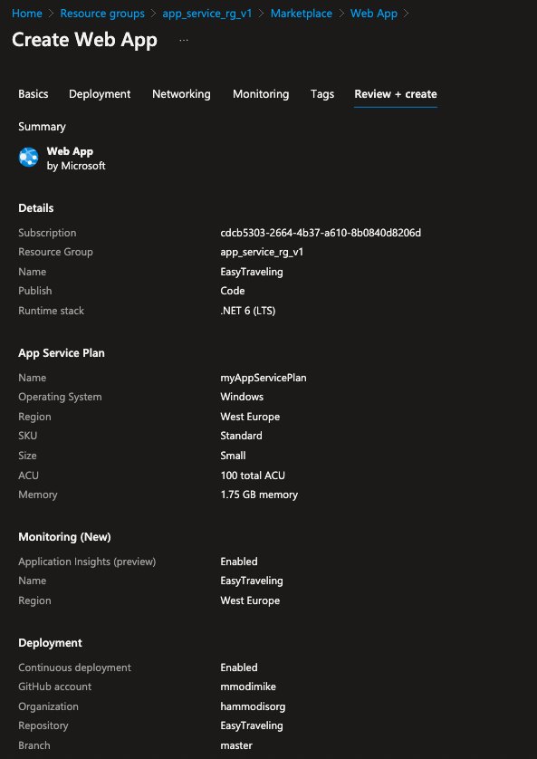
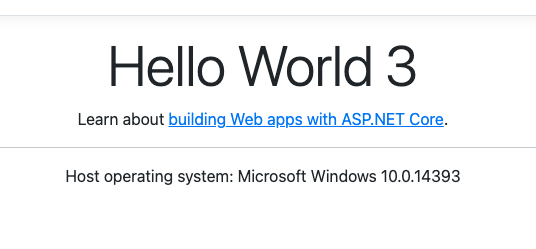

<!-- TABLE OF CONTENTS -->
<details>
  <summary>Table of Contents</summary>
  <ol>
    <li>
      <a href="#about-the-project">About The Project</a>
      <ul>
        <li><a href="#built-with">Built With</a></li>
      </ul>
    </li>
    <li>
      <a href="#getting-started">Getting Started</a>
      <ul>
        <li><a href="#prerequisites">Prerequisites</a></li>
        <li><a href="#installation">Installation</a></li>
      </ul>
    </li>
    <li><a href="#usage">Usage</a></li>
    <li><a href="#roadmap">Roadmap</a></li>
    <li><a href="#contributing">Contributing</a></li>
    <li><a href="#license">License</a></li>
    <li><a href="#contact">Contact</a></li>
    <li><a href="#acknowledgments">Acknowledgments</a></li>
  </ol>
</details>


<!-- ABOUT THE PROJECT -->
## The Task Instructions 
Create an Azure app service that alerts when CPU is higher than 50% for over 5 minutes.<br/>
Please deploy a file index.html that says “Hello World1” and connect a repo of your choice.<br/>
Then, update the repo with “Hello World2” and deploy it again.<br/>
The deployment should swap between slots of the app service.
<br/><br/><br/>

<!-- High Level Plan -->
# <ins>High Level Plan<ins/>
I will break the task into two parts:
* Setting up the infra & deploy configuration
* Setting up the alert<br/><br/> 


Here is a high level description of what I will be doing to reach our goal for part 1:
<br/>


### Azure
* Create a Resource Group 
* Create a Service Plan within our resource group 
* Create an App Service (Webapp) within our resource group 
* Create a secondary (staging) slot to implement swapping
* Connect our staging app to source control
* Enable “auto-swap” on the secondary slot.
* Configure deploy .yml to deploy to staging


### GitHub
* Fork a “Hello world” ASP.NET demo webapp project 
* Alter the index.cshtml for our needs
* Alter the deploy .yml file to target staging slot 
* Change the "publish profile" secret to support our staging environment 
<br/><br/><br/><br/>


Here is a high level description of what I will be doing to reach our goal for part 2:<br/>
### Azure


<!-- Getting Started -->
# <ins>Steps</ins>
Here is a step to step breakdown explaining what I did to set up our Azure App. 
<br/><br/><br/>


# <ins>Step 1</ins> - <b>Create a Git Repo</b>
Create a new repo by forking a .NET 6 Hello world project.<br/>
Original forker repo can be found [here](https://github.com/Azure-Samples/dotnetcore-docs-hello-world).


 <br/><br/>


# <ins>Step 2</ins> - <b>Create Resource Group</b>
We can use azcli to create a resource group to contain all of the Azure resources for this service.
  ```sh
  az group create -l westeurope -n app_service_rg_v1
  ```


 <br/><br/>


 # <ins>Step 3</ins> - <b>Create App Service</b>
Using azure portal, navigate to resource group → create → App Service Plan <br/>
  <br/>
 
*  Upon creating documentation for the assignment submission I kept running into issues creating a new service plan: message:<br/> 
_"App Service Plan Create operation is throttled for subscription cdcb5303-2664-4b37-a610-8b0840d8206d. Please contact support if issue persists."_
<br/>
* I was developing the solution using terraform, which probably triggered throttling. 
<br/> For the rest of the steps I will use the original service plan I created for development.


<br/><br/>


# <ins>Step 4</ins> - <b>Create Web App</b>
Under App Services click create Web App.<br/>
Make sure to Enable Continuous deployment under Github Action Settings. This option will auto-generate a git Actions workflow which we will be using.
  <br/>
  <br/>


<br/><br/>

# <ins>Step 5</ins> - <b>Add a second deployment slot</b>
Go to the resource group → App Service.<br/>
Under Deployment Slots → Add Slot → ( we will call it staging )<br/>
  


<br/><br/>


# <ins>Step 6</ins> - <b>Deploy Hello World 1<b/>
Currently, we have two slots:
* Production: https://easytraveling.azurewebsites.net/<br/>
  _Our app is currently deployed here, currently it displays this_<br/>
   <br/><br/>


* Staging: https://easytraveling-staging.azurewebsites.net/<br/>
  _Nothing is Deployed here yet._<br/><br/>


Lets go to our codebase and alter index.cshtml to display Hello World 1<br/>
We navigate to our repo and alter the index.cshtml file:<br/>
_https://github.com/hammodisorg/EasyTraveling/blob/master/Pages/Index.cshtml_<br/>
  <br/><br/>

The commit will trigger our gitflow workflow & re-deploy our updated code to Production.<br/>
After the above commit, this is the status of our environments:<br/>
* Production: https://easytraveling.azurewebsites.net/<br/>
  _Our app is currently deployed here, but now with the correct text_<br/>
   <br/><br/>


* Staging: https://easytraveling-staging.azurewebsites.net/<br/>
  _Nothing is Deployed here yet._<br/><br/>


<br/><br/>


# <ins>Step 7</ins> - <b>Configure the “staging” deployment slot for auto swap<b/>
* Go to the resource group → staging (easytraveling/staging) (App Service Slot)<br/>
* On the left bar Setting menu → Configuration → General settings<br/>
* Scroll Down to Deployment Slot:<br/>
* Auto Swap Enabled → true<br/>
* Auto Swap deployment (target) → production<br/>


<br/><br/>


# <ins>Step 8</ins> - <b>Alter gitflow workflow to target staging slot instead of Production<b/>
Our .yml file can be found here:<br/>
We want to change slot name to staging.<br/>
https://github.com/hammodisorg/EasyTraveling/blob/master/.github/workflows/master_easytraveling.yml<br/>
 <br/><br/>


<br/><br/>


# <ins>Step 9</ins> - <b>Update publish-profile Secret for Git Actions<b/>
We Will Also have to update the Git Actions secret to reflect the staging slot publish-profile, instead of the existing production publish-profile.<br/>
This is done by navigating to staging slot on Azure and clicking “Download publish profile” from the top bar.<br/>
 <br/><br/>

We then update the secret value in our Github Repo by navigating to Settings --> Security --> Secrects & Variables --> Actions<br/>
 <br/><br/>


<br/><br/>


# <ins>Step 10</ins> - <b>Update Repo index with Hello World 2<b/>
Finally, we will change index.cshtml to Hello World 2.<br/>
_( I grouped this commit with the above gitflow change as to trigger a single deployment)_<br/><br/>

The commit will trigger a deployment, target slot is staging. <br/>
Once the deployment is complete, App Service should swap Production (Hello World 1) with staging (Hello World 2).<br/><br/>

This is the status after deployment<br/>

* Production: https://easytraveling.azurewebsites.net/<br/>
   <br/><br/>


* Staging: https://easytraveling-staging.azurewebsites.net/<br/>
   <br/><br/>


<br/><br/>


# <ins>Step 11</ins> - <b>Verify it works again<b/>
I will disconnect the production slot from a Source code and commit a Hello World 3 to our repo.<br/> 
This step does not appear to be necessary as the workflow determines target enviroment, but for the time being this sounds safer to avoid unwanted mistakes.<br/>
Expected result is to have it deployed to staging, swapped into production.<br/>
Thus having Production reflect "Hello World 3", & Staging "Hello World 2".<br/><br/>
 <br/><br/>

This is the status after deployment<br/>

* Production: https://easytraveling.azurewebsites.net/<br/>
   <br/><br/>


* Staging: https://easytraveling-staging.azurewebsites.net/<br/>
   <br/><br/>


<br/><br/>
